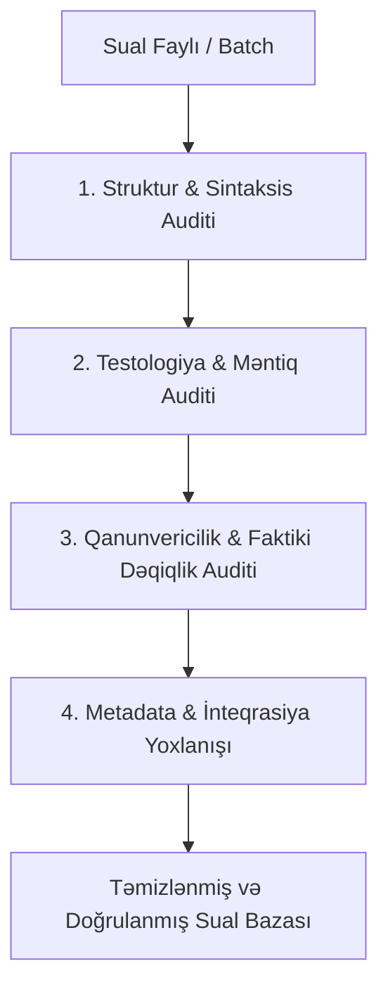

# Quiz Question Auditor: Testologiya və Sualların Keyfiyyət Auditi Bacarığı

Bu bacarıq istənilən fənn (Dövlət Qulluğu Qanunvericiliyi, Məntiq, İnformatika, Xarici dil, Riyaziyyat və s.) üzrə hazırlanmış test suallarının **testologiya standartlarına**, **qanunvericilik və faktiki dəqiqliyə**, **daxili məntiqə** və **sistem parser strukturuna** uyğunluğunu yoxlamaq, xətaları aşkarlamaq və tam hazır vəziyyətə gətirmək üçün istifadə olunur.

---

## 1. 🎯 Əsas Missiya və Audit Qaydaları

Hər bir sual faylı aşağıdakı 4 mərhələli filtrdən keçirilməlidir:



---

## 2. 📋 Detallı Audit Meyarları

### A. Testologiya və Məntiq Qaydaları (Testology & Logic)
1. **İnkarlıq və Tərs Məntiq Yoxlanışı (Negative Polarity Check):**
   - Sualın şərtində *"doğru deyil"*, *"aid deyil"*, *"uyğun deyil"*, *"mümkün deyil"*, *"istisnadır"*, *"səhvdir"* kimi inkarlıq ifadələri olduqda, cavab açarının mütləq **səhv/yalan müddəaya** yönəldiyini yoxlayın. (Test bazalarında ən çox rast gəlinən xəta: inkarlı suala doğru bəndin açar qoyulmasıdır).
2. **Variantların Bircinsliliyi (Homogeneity):**
   - Variantlar uzunluq, qrammatik quruluş və mürəkkəblik baxımından bir-birinə bərabər olmalıdır.
   - Doğru cavab digər variantlardan daha uzun və ya həddən artıq detallı olaraq "özünü ələ verməməlidir".
3. **Yeganə Doğru Cavab Prinsipi (Single Unambiguous Key):**
   - Eyni sualda bir neçə variant eyni vaxtda doğru ola bilməz (əgər çoxseçimli sual deyilsə).
   - Bütün variantların səhv olduğu və ya heç bir doğru cavabın olmadığı suallar aradan qaldırılmalıdır.
4. **Daxili İstinadların Doğruluğu (Sub-item Consistency):**
   - Əgər sualda rəqəmlənmiş müddəalar (`1.`, `2.`, `3.`...) varsa və variantlar `1, 3, 5` kimi kombinasiyalardan ibarətdirsə:
     - Sual mətni daxilində həmin nömrələrin mövcudluğunu yoxlayın.
     - Sual mətnində olmayan nömrənin variantda yer alması (məsələn, 4 bənd verilibsə variantda "5" rəqəminin olması) kobud xətadır.
5. **Cavabı Ələ Vermə (Cueing / Clues):**
   - Bir sualın mətni və ya izahı başqa bir sualın cavabını ifşa etməməlidir.

---

### B. Qanunvericilik və Faktiki Dəqiqlik (Domain & Legislative Accuracy)
1. **Qüvvədə Olan Qanunvericiliklə Tutuşdurma:**
   - Xüsusilə Azərbaycan Respublikasının Qanunvericiliyi (Dövlət Qulluğu, Konstitusiya, İnzibati İcraat və s.) üzrə ən son dəyişikliklər (məs: 2024-cü il islahatları, vəzifə təsnifatları, attestasiya qaydaları) əsas götürülməlidir.
2. **Ləğv Edilmiş və ya Yenidən Təşkil Olunmuş Qurumlar:**
   - Köhnəlmiş orqan adları (məs: *MTRŞ* ➔ *Audiovizual Şura*, *İnzibati-iqtisadi məhkəmə* ➔ *İnzibati məhkəmə / Kommersiya məhkəməsi*) müasir hüquqi adlarla əvəz edilməlidir.
3. **Təsnifat və İxtisas Dərəcəsi İerarxiyası:**
   - İnzibati və yardımçı vəzifələrin təsnifat pillələri (1-7, Ali) ilə onlara uyğun gələn ixtisas dərəcələri arasında ziddiyyət olmamalıdır.
4. **İzahatların Hüquqi Əsaslandırılması:**
   - `İzahat:` bölməsində göstərilən maddə və bənd nömrəsi sualın mövzusu ilə 100% uyğunlaşmalıdır.

---

### C. Markdown Struktur və Sintaksis Standartları (Parser Compatibility)
1. **Sual Başlığı:**
   - Hər sual mütləq `# Sual mətni` və ya `# Sual N: Mətn` ilə başlamalıdır.
2. **Alt Bəndlərin Yazılışı:**
   - Alt bəndlər `1. Mətn`, `2. Mətn` formatında olmalıdır (nöqtədən sonra mütləq boşluq qoyulmalıdır: `1. Mətn` ✔, `1.Mətn` ✖).
3. **Variantların Formatı:**
   - Variantlar ardıcıl və standart olmalıdır:
     ```markdown
     A) Variant mətni
     B) Variant mətni
     C) Variant mətni
     D) Variant mətni
     E) Variant mətni
     ```
4. **Metadata Sahələri və Açar Sözlər:**
   - `Cavab: A` (və ya `Cavab: A, C` / `Cavab: 1-a, 2-b`)
   - `Tip: single_choice | multi_choice | true_false | matching | fill_blank | ordering`
   - `Kateqoriya: Dövlət Qulluğu`
   - `Çətinlik: asan | orta | çətin`
   - `İpucu: ...`
   - `İzahat: ...`
   - `Bloom: Xatırlama | Anlama | Tətbiq | Təhlil | Dəyərləndirmə | Yaratma`
   - `Taqlar: tag1, tag2`
   - Suallar arasında ayırıcı xətt: `---`
5. **Riyazi və Xüsusi İfadələrin Formatlanması:**
   - Bütün riyazi formul və simvollar KaTeX formatında `$ ... $` daxilində yazılmalıdır.

---

## 3. 📦 Böyük Həcmli Faylların Hissə-Hissə Analiz Protokolu (Batch Processing Protocol)

Əgər faylda sualların sayı **50-dən çoxdursa**, analiz aşağıdakı ardıcıllıqla icra edilir:

1. **Faylın Seqmentasiyası (Batching):**
   - Suallar 25-50 suallıq bloklara ayrılır (Məsələn: `Batch 1: Q1-Q50`, `Batch 2: Q51-Q100`, və s.).
2. **Hissə-Hissə Dərin Audit:**
   - Hər bir batch üçün yuxarıdakı 4 mərhələli yoxlama icra olunur.
   - Aşkarlanan xətalar (Səhv açar, köhnə qanun, struktur qüsuru) konkret sual nömrəsi ilə sənədləşdirilir.
3. **Düzəliş və Birləşdirmə (Reassembly):**
   - Düzəlişlər tətbiq edilir və yekun bütöv fayl formalaşdırılır.
4. **Avtomatlaşdırılmış Parser Doğrulaması:**
   - Fayl layihənin parser skripti ilə test edilir (heç bir xətanın qalmadığı təsdiqlənir).

---

## 4. 🛠️ Audit Hesabatının Şablonu

Hər auditdən sonra təqdim ediləcək hesabat strukturu:

```markdown
### 📊 Audit Nəticəsi Xülasəsi
- **Ümumi sual sayı:** N
- **Təftiş edilən kateqoriya:** [Məs: Dövlət Qulluğu Qanunu / Məntiq]
- **Kritik Xətalar (Cavab açarı səhv olan):** X ədəd
- **Qanunvericilik/Faktiki uyğunsuzluqlar:** Y ədəd
- **Struktur və format qüsurları:** Z ədəd

### 🔍 Aşkarlanan Xətalar və Düzəlişlər Cədvəli
| Sual № | Mövcud Xəta | Hüquqi / Testoloji Fakt | Tətbiq Edilən Düzəliş |
| :--- | :--- | :--- | :--- |
| **Sual X** | Cavab Açar: B | Qanunun X maddəsinə əsasən... | Düzgün cavab: C |
```
